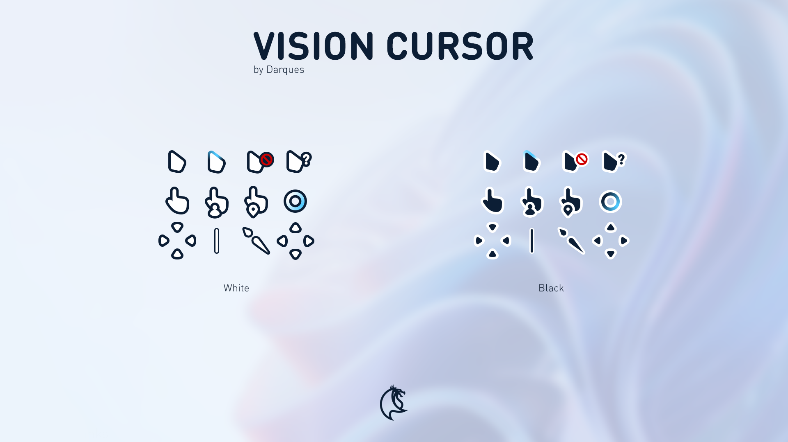

## Vision Cursor, a minimalist cursor inspired by Windows 11 style



# Installation Guide:

<details>
<summary>
    Windows
</summary>
  
  Open .zip file with WinRAR or 7Zip.

  Move folder with files on desktop or wherever you want.

  Open it, right click on Install.inf file and select the Install option.

  Go to [Control Panel > Mouse > Pointers] or [Settings > Personalization > Themes > Mouse Cursor > Pointers]

  Select the Cursor in the Scheme menu.

</details>

<details>
<summary>
    Linux 
</summary>
    
extract `vision.cursor.tar.gz`

```bash
tar -xvf vision.cursor.tar.gz
```
Move the extracted folder to `icons` folder, change `<color>` to `black` or `white`
```bash
mv Vision-<color> ~/.icons/        	       # Install to local users
sudo mv Vision-<color> /usr/share/icons/      # Install to all users
```

Now, change your cursor using Gnome, or other manager

</details>

# Uninstallation Guide
<details>
 <summary>
    Linux
 </summary>

Uninstallation
```bash
rm ~/.icons/Vision-<color>                  # Remove from local users
sudo rm /usr/share/icons/Vision-<color>     # Remove from all users
```

</details>


# License

Original work by [iDarques](https://www.deviantart.com/idarques)

This work is licensed under a
[Creative Commons Attribution-NonCommercial-NoDerivatives 4.0 International License][cc-by-nc-nd].

[![CC BY-NC-ND 4.0][cc-by-nc-nd-image]][cc-by-nc-nd]

[cc-by-nc-nd]: http://creativecommons.org/licenses/by-nc-nd/4.0/
[cc-by-nc-nd-image]: https://licensebuttons.net/l/by-nc-nd/4.0/88x31.png
[cc-by-nc-nd-shield]: https://img.shields.io/badge/License-CC%20BY--NC--ND%204.0-lightgrey.svg
